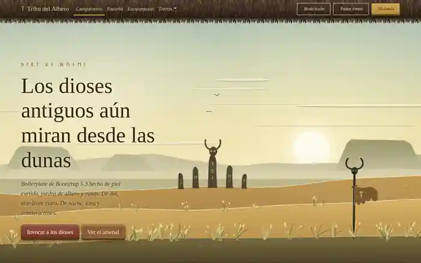

# Barbarian Theme

<p align="center">
  <a href="https://vgarcan.github.io/barbarian-theme/"><strong>🌐 Visita la página</strong></a>
</p>

<p align="center">
  <a href="https://vgarcan.github.io/barbarian-theme/">
    
  </a>
</p>

A configurable visual theme for **Bootstrap 5.3**. Standard Bootstrap buttons, forms, cards, navbars, modals, tables, alerts, navigation and feedback components adopt the Barbarian visual language without changing their markup.

The desert canvas is an **optional effect**, not a dependency of the theme.

## Use it in a Bootstrap project

Load Bootstrap first and Barbarian Theme after it:

```html
<link
  rel="stylesheet"
  href="https://cdn.jsdelivr.net/npm/bootstrap@5.3.3/dist/css/bootstrap.min.css"
>

<link rel="stylesheet" href="barbarian-theme.min.css">
```

That is enough for the CSS theme. Existing Bootstrap markup such as:

```html
<button class="btn btn-primary">Attack</button>

<div class="card">
  <div class="card-header">Warband</div>
  <div class="card-body">...</div>
</div>
```

is automatically styled by Barbarian Theme.

The JavaScript bundle is optional:

```html
<script src="barbarian-theme.min.js"></script>
```

It provides helpers for color mode and visual variants. Bootstrap's own JavaScript remains responsible for Bootstrap behaviour such as modals, dropdowns and offcanvas.

## Configuration API

Customize the theme by overriding public `--barbarian-*` tokens. Components should not need to be edited.

```css
:root {
  --barbarian-primary: #d6a13c;
  --barbarian-leather: #8b5a33;
  --barbarian-surface: #ddbf88;
  --barbarian-border: #8b5a33;
  --barbarian-radius: .25rem;
}
```

Typical public tokens include:

```css
--barbarian-primary
--barbarian-primary-light
--barbarian-primary-dark
--barbarian-secondary
--barbarian-danger
--barbarian-leather
--barbarian-leather-dark
--barbarian-fur
--barbarian-bone
--barbarian-ember

--barbarian-surface
--barbarian-surface-raised
--barbarian-field
--barbarian-field-focus
--barbarian-sunken

--barbarian-text
--barbarian-text-muted
--barbarian-heading
--barbarian-accent
--barbarian-border
--barbarian-field-border

--barbarian-radius
--barbarian-radius-sm
--barbarian-radius-lg

--barbarian-font-body
--barbarian-font-heading
--barbarian-font-runes
```

See [Configuration](docs/configuration.md) for the full model.

## Built-in variants

The production CSS bundle includes five visual variants:

- `desert` — default
- `nordic`
- `blood`
- `ice`
- `dark-kingdom`

Set one on the document root:

```html
<html data-barbarian-variant="ice">
```

Color mode continues to use Bootstrap's standard attribute:

```html
<html
  data-bs-theme="dark"
  data-barbarian-variant="dark-kingdom"
>
```

Or use the optional JS API:

```js
BarbarianTheme.setVariant('nordic');
BarbarianTheme.setColorMode('dark');
BarbarianTheme.toggleColorMode();
```

## KPI and character sheet components

Barbarian Theme also includes reusable components for RPG character sheets and dashboards:

- scalar KPI cards;
- health / mana / stamina style resources;
- attributes with min/max scales;
- radial percentage indicators;
- deltas and trend states;
- a responsive character-sheet layout.

Static KPIs work with CSS only. The optional JavaScript API can update values and accessibility metadata:

```js
BarbarianTheme.setKpiValue('#player-health', 72);
BarbarianTheme.changeKpiValue('#player-health', -15);
```

See [KPI and character sheet components](docs/kpis.md).

## Theme and effects are separate

The core theme does **not** import the desert scene.

A normal application can use only:

```html
<link rel="stylesheet" href="dist/barbarian-theme.min.css">
```

To opt into the desert effect:

```html
<link rel="stylesheet" href="dist/effects/desert.min.css">

<canvas id="escena" aria-hidden="true"></canvas>

<script src="dist/effects/desert.min.js"></script>
<script>
  BarbarianDesert.initDesertEffect();
</script>
```

The effect is deliberately independent so dashboards, admin applications and normal Bootstrap sites do not pay for particles, wind or canvas rendering.

## Project architecture

```text
barbarian-theme/
├── src/
│   ├── barbarian-theme.css
│   ├── barbarian-theme.js
│   ├── core/
│   │   ├── tokens.css
│   │   ├── foundation.css
│   │   ├── surfaces.css
│   │   ├── runes.css
│   │   └── layout.css
│   ├── components/
│   │   ├── buttons.css
│   │   ├── cards.css
│   │   ├── forms.css
│   │   ├── navbar.css
│   │   ├── tables.css
│   │   ├── navigation.css
│   │   ├── collections.css
│   │   ├── overlays.css
│   │   ├── feedback.css
│   │   └── alerts-badges.css
│   ├── themes/
│   │   ├── desert.css
│   │   ├── nordic.css
│   │   ├── blood.css
│   │   ├── ice.css
│   │   └── dark-kingdom.css
│   ├── effects/
│   │   └── desert/
│   │       ├── index.js
│   │       ├── desert-scene.js
│   │       └── effect.css
│   └── img/
│       └── texturas/
├── demo/
│   ├── demo.css
│   └── demo.js
├── dist/
│   ├── barbarian-theme.css
│   ├── barbarian-theme.min.css
│   ├── barbarian-theme.js
│   ├── barbarian-theme.min.js
│   └── effects/
├── scripts/
│   └── build.mjs
├── index.html
└── package.json
```

### Responsibility boundaries

**Core** contains design tokens, typography, reusable surfaces and shared layout rules.

**Components** skin normal Bootstrap selectors. They contain no demo logic and no desert animation.

**Themes** change public tokens only. A new visual family should normally be implemented here rather than editing every component.

**Effects** are optional presentation extras and are never imported by the core theme.

**Demo** contains everything needed only by the documentation/showcase page.

**Dist** contains production bundles generated from `src/`.

## Production bundles

The build creates:

```text
dist/barbarian-theme.css
dist/barbarian-theme.min.css
dist/barbarian-theme.js
dist/barbarian-theme.min.js

dist/effects/desert.css
dist/effects/desert.min.css
dist/effects/desert.js
dist/effects/desert.min.js
```

SVG textures are bundled into the production CSS by esbuild, so the main stylesheet can be distributed as a self-contained visual skin.

## Development

Install the build dependency:

```bash
npm install
```

Generate all production files:

```bash
npm run build
```

The project uses **esbuild** for CSS bundling, JavaScript bundling and minification.

The GitHub Actions build also regenerates and commits `dist/` when source files change.

## Showcase

`index.html` is no longer the application architecture. It is only the **documentation and component showcase**.

Importantly, the showcase consumes:

```html
<link rel="stylesheet" href="dist/barbarian-theme.min.css">
<script src="dist/barbarian-theme.min.js"></script>
```

so the live GitHub Page exercises the same production bundle that another Bootstrap project would use.

## Performance

The theme itself contains no continuously running animation.

The optional desert effect:

- starts static by default on mobile;
- uses adaptive frame rates;
- reduces particle density and device-pixel-ratio on smaller devices;
- pauses while the page is hidden;
- avoids expensive canvas rebuilds caused by mobile browser chrome resizing;
- yields rendering budget during user interactions.

Mobile CSS also simplifies expensive texture and shadow composition where necessary.

## Current status

Barbarian Theme is currently an early reusable library release (`0.1.x`). The API is usable, but names and packaging may still evolve before a first stable release.
